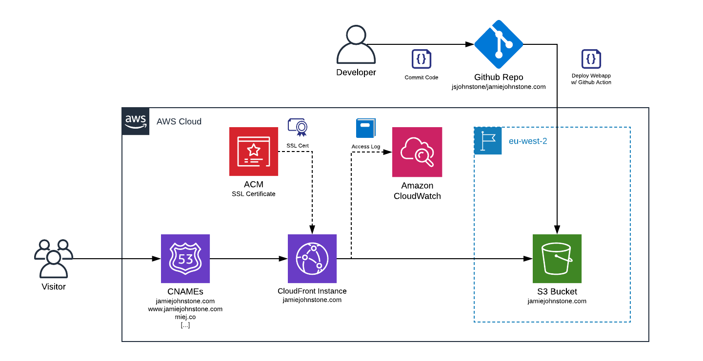

# jamiejohnstone.com :wave:
Personal Website Repo hosted at www.jamiejohnstone.com

## Infrastructure Diagram

## Deployment
Pushing to the src/ directory will trigger a [Github Action](.github/workflows/main.yml) that:
* checks out the current codebase
* timestamps the index.html file
* uploads the contents of src/ to S3
* triggers a cache invalidation in CloudFront

For more information on the upload script, check out [jsjohnstone/s3-site-deploy](https://github.com/jsjohnstone/s3-site-deploy/).

## Files
    .
    ├── .github/workflows/       # CI/CD Workflows
    ├── infra/                   # Infrastructure Code
    ├── src/                     # Website source
    ├── docs/                    # Additional files used in the project
    └── README.md
